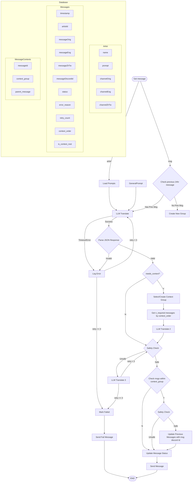

# Bubble Beaver Discord Bot

A Discord bot that helps translate lyrics and messages from multiple artists using LLM capabilities.

## Features

- Multi-language translation support
- Artist-specific translation handling
- Customizable LLM prompts for different translation styles
- Docker containerization for easy deployment

## Requirements

- Python 3.9+
- Discord.py
- Docker
- Conda environment

## Setup

1. Create conda environment:
```bash
conda env create -f environment.yml
```

2. Activate the environment:
```bash
conda activate bubble-beaver
```

3. Set up your Discord bot token:
Create a `.env` file and add your Discord token:
```
DISCORD_TOKEN=your_token_here
OPENAI_API_KEY=your_openai_key_here
```

4. Build and run with Docker:
```bash
docker build -t bubble-beaver .
docker run -d --env-file .env bubble-beaver
```
Or run with Conda environment:
```bash
conda env create -f environment.yml
conda activate bubble-beaver
python main.py
```

## Flow Diagram



## Usage

- `/mirror_channel <artist_name>` - Create mirror channels..
    - These channels will be served as a mirror of a single artist's messages.
    - Original Channel will be used to paste messages with the original language.
    - The bot will translate the messages to the target languages and paste them to channel mirrors.
    - This command will create 3 channels for the mirror with name `<artist_name>_original`, `<artist_name>_eng`, and `<artist_name>_zh-tw`.
- `/show <artist_name>` - Show the translation prompt for the artist.
- `/modify <artist_name>` - Modify the translation prompt for the artist. A textarea will show up with the current prompts.


## License

MIT License - See LICENSE file for details
